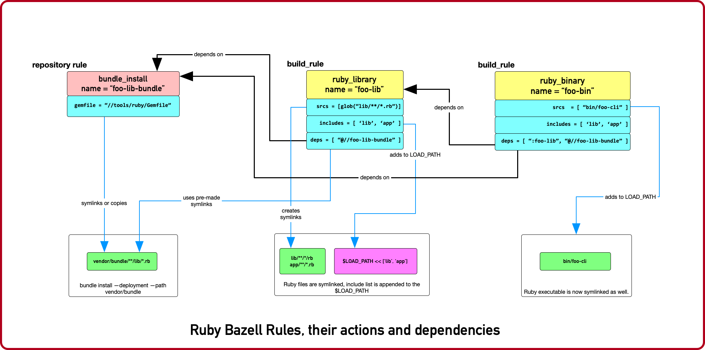

# Rules Ruby Version 0.4.1

This is the README for Ruby Rules for the [Bazel Build](https://bazel.build) system.

## ATTENTION: Base Branch Change Announcement

We recently switched from the base branch of `develop` to the base of `master`. Please update your local repos accordingly.

### Build Status

[](https://circleci.com/gh/bazelruby/rules_ruby) &nbsp;
[](https://travis-ci.org/bazelruby/rules_ruby) &nbsp;

 &nbsp;

- [Rules Development Status](#rules-development-status)
- [Usage](#usage)
  - [`WORKSPACE` File](#workspace-file)
    - [Load dependencies, select Ruby SDK and define one or more Bundles](#load-dependencies-select-ruby-sdk-and-define-one-or-more-bundles)
  - [`BUILD.bazel` file(s)](#buildbazel-files)
    - [Define Ruby Executable, Library and an RSpec](#define-ruby-executable-library-and-an-rspec)
    - [Package Ruby files as a Gem](#package-ruby-files-as-a-gem)
  - [Rule Dependency Diagram](#rule-dependency-diagram)
- [Rules](#rules)
  - [`ruby_library`](#ruby_library)
  - [`ruby_binary`](#ruby_binary)
  - [`ruby_test`](#ruby_test)
  - [`ruby_bundle`](#ruby_bundle)
    - [Limitations](#limitations)
    - [Conventions](#conventions)
    - [`WORKSPACE`:](#workspace)
    - [`BUILD.bazel`:](#buildbazel)
  - [`ruby_rspec`](#ruby_rspec)
  - [`ruby_gem`](#ruby_gem)
- [What's coming next](#whats-coming-next)
- [Contributing](#contributing)
  - [Setup](#setup)
    - [Using the Script](#using-the-script)
    - [OS-Specific Setup](#os-specific-setup)
      - [Issues During Setup](#issues-during-setup)
  - [Developing Rules](#developing-rules)
  - [Running Tests](#running-tests)
    - [Test Script](#test-script)
  - [Linter](#linter)
- [Copyright](#copyright)


### [Change Log](CHANGELOG.md)

To regenerate:

```bash
gem install github_changelog_generator
github_changelog_generator -u bazelruby -p rules_ruby
```

## Rules Development Status

| **Readiness**                               | **Types of Applications**                                    |
| :------------------------------------------ | :----------------------------------------------------------- |
|          | ruby apps, ruby gems, micro-services, ideally in a mono-repo |
|            | medium-sized Ruby on Rails apps, ideally in a mono-repo      |
|  | complex Ruby on Rails monoliths, single-repo                 |


Note: we have a short guide on [Building your first Ruby Project](https://github.com/bazelruby/rules_ruby/wiki/Build-your-ruby-project) on the Wiki. We encourage you to check it out.

## Usage

### `WORKSPACE` File

#### Load dependencies, select Ruby SDK and define one or more Bundles

```bazel
workspace(name = "my_ruby_project")

load("@bazel_tools//tools/build_defs/repo:http.bzl", "http_archive")
load("@bazel_tools//tools/build_defs/repo:git.bzl", "git_repository")

#———————————————————————————————————————————————————————————————————————
# To get the latest ruby rules, grab the 'master' branch.
#———————————————————————————————————————————————————————————————————————

git_repository(
    name = "bazelruby_rules_ruby",
    remote = "https://github.com/bazelruby/rules_ruby.git",
    branch = "master"
)

load(
    "@bazelruby_rules_ruby//ruby:deps.bzl",
    "rules_ruby_dependencies",
    "rules_ruby_select_sdk",
)

rules_ruby_dependencies()

#———————————————————————————————————————————————————————————————————————
# Specify Ruby version — this will either build Ruby or use a local
# RBENV installation if the Ruby version matches.
#———————————————————————————————————————————————————————————————————————

load("@bazel_skylib//:workspace.bzl", "bazel_skylib_workspace")
bazel_skylib_workspace()

rules_ruby_select_sdk(version = "2.7.1")

#———————————————————————————————————————————————————————————————————————
# Now, load the ruby_bundle rule & install gems specified in the Gemfile
#———————————————————————————————————————————————————————————————————————

load(
    "@bazelruby_rules_ruby//ruby:defs.bzl",
    "ruby_bundle",
)

ruby_bundle(
    name = "bundle",
    excludes = {
        "mini_portile": ["test/**/*"],
    },
    gemfile = "//:Gemfile",
    gemfile_lock = "//:Gemfile.lock",
)

# You can specify more than one bundle in the WORKSPACE file
ruby_bundle(
    name = "bundle_app_shopping",
    gemfile = "//apps/shopping:Gemfile",
    gemfile_lock = "//apps/shopping:Gemfile.lock",
)
```

### `BUILD.bazel` file(s)

Any of the project `BUILD` files can now reference any gems included in the `Gemfile` referenced by the `ruby_bundle` rule, and defined in the project's `WORKSPACE` file.

#### Define Ruby Executable, Library and an RSpec

Add `ruby_library`, `ruby_binary`, `ruby_rspec` or `ruby_test` into your `BUILD.bazel` files.

```bazel
#———————————————————————————————————————————————————————————————————————
# Define Ruby executable, test, spec and package a gem
#———————————————————————————————————————————————————————————————————————

load(
    "@bazelruby_rules_ruby//ruby:defs.bzl",
    "ruby_binary",
    "ruby_library",
    "ruby_test",
    "ruby_rspec",
)

ruby_library(
    name = "foo",
    srcs = glob(["lib/**/*.rb"]),
    includes = ["lib"],
    deps = [
      "@bundle//:activesupport",
      "@bundle//:awesome_print",
      "@bundle//:rubocop",
    ]
)

ruby_binary(
    name = "bar",
    srcs = ["bin/bar"],
    deps = [":foo"],
)

ruby_test(
    name = "foo-test",
    srcs = ["test/foo_test.rb"],
    deps = [":foo"],
)

ruby_rspec(
    name = "foo-spec",
    specs = glob(["spec/**/*.rb"]),
    rspec_args = { "--format": "progress" },
    deps = [":foo"]
}
```

#### Package Ruby files as a Gem

Use `ruby_gem` rule to package any number of ruby files or folders into a Ruby-Gem compatible ZIP archive.

```bazel
load(
    "@bazelruby_rules_ruby//ruby:defs.bzl",
    "ruby_gem",    
)

ruby_gem(
    name            = "awesome-sauce-gem", # name of the build target
    gem_name        = "awesome-sauce",     # name of the gem
    gem_version     = "0.1.0",
    gem_summary     = "Example gem to demonstrate Bazel Gem packaging",
    gem_description = "Example gem to demonstrate Bazel Gem packaging",
    gem_homepage    = "https://github.com/bazelruby/rules_ruby",    
    gem_authors     = [
        "BazelRuby",
        "Konstantin Gredeskoul"
    ],
    gem_author_emails = [
        "bazelruby@googlegroups.com",
    ],
    gem_runtime_dependencies = {
        "colored2": "~> 3.1.2",
        "hashie": "",
    },
    gem_development_dependencies = {
        "rspec": "",
        "rspec-its": "",
        "rubocop": "",
    },
    srcs = [
	 	glob("{bin,exe,lib,spec}/**/*.rb")
    ],
    deps = [
        "//lib:example_gem",
    ],
)

```

### Rule Dependency Diagram

> NOTE: this diagram is slightly outdated.

The following diagram attempts to capture the implementation behind `ruby_library` that depends on the result of `bundle install`, and a `ruby_binary` that depends on both:



## Rules

### `ruby_library`

```bazel
ruby_library(
    name, 
    deps, 
    srcs, 
    data, 
    compatible_with, 
    deprecation, 
    distribs, 
    features, 
    licenses, 
    restricted_to, 
    tags, 
    testonly, 
    toolchains, 
    visibility)
```

<table class="table table-condensed table-bordered table-params">
  <colgroup>
    <col class="col-param" />
    <col class="param-description" />
  </colgroup>
  <thead>
    <tr>
      <th colspan="2">Attributes</th>
    </tr>
  </thead>
  <tbody>
    <tr>
      <td><code>name</code></td>
      <td>
        <code>Name, required</code>
        <p>A unique name for this rule.</p>
      </td>
    </tr>
    <tr>
      <td><code>srcs</code></td>
      <td>
        <code>List of Labels, optional</code>
        <p>
          List of <code>.rb</code> files.
        </p>
        <p>At least <code>srcs</code> or <code>deps</code> must be present</p>
      </td>
    </tr>
    <tr>
      <td><code>deps</code></td>
      <td>
        <code>List of labels, optional</code>
        <p>
          List of targets that are required by the <code>srcs</code> Ruby
          files.
        </p>
        <p>At least <code>srcs</code> or <code>deps</code> must be present</p>
      </td>
    </tr>
    <tr>
      <td><code>includes</code></td>
      <td>
        <code>List of strings, optional</code>
        <p>
          List of paths to be added to <code>$LOAD_PATH</code> at runtime.
          The paths must be relative to the the workspace which this rule belongs to.
        </p>
      </td>
    </tr>
    <tr>
      <td><code>rubyopt</code></td>
      <td>
        <code>List of strings, optional</code>
        <p>
          List of options to be passed to the Ruby interpreter at runtime.
        </p>
        <p>
          NOTE: <code>-I</code> option should usually go to <code>includes</code> attribute.
        </p>
      </td>
    </tr>
  </tbody>
  <tbody>
    <tr>
      <td colspan="2">And other <a href="https://docs.bazel.build/versions/master/be/common-definitions.html#common-attributes">common attributes</a></td>
    </tr>
  </tbody>
</table>

### `ruby_binary`

```bazel
ruby_binary(
    name, 
    deps, 
    srcs, 
    data,
    main, 
    compatible_with, 
    deprecation, 
    distribs, 
    features, 
    licenses, 
    restricted_to, 
    tags, 
    testonly,     
    toolchains, 
    visibility, 
    args, 
    output_licenses
)
```

<table class="table table-condensed table-bordered table-params">
  <colgroup>
    <col class="col-param" />
    <col class="param-description" />
  </colgroup>
  <thead>
    <tr>
      <th colspan="2">Attributes</th>
    </tr>
  </thead>
  <tbody>
    <tr>
      <td><code>name</code></td>
      <td>
        <code>Name, required</code>
        <p>A unique name for this rule.</p>
      </td>
    </tr>
    <tr>
      <td><code>srcs</code></td>
      <td>
        <code>List of Labels, required</code>
        <p>
          List of <code>.rb</code> files.
        </p>
      </td>
    </tr>
    <tr>
      <td><code>deps</code></td>
      <td>
        <code>List of labels, optional</code>
        <p>
          List of targets that are required by the <code>srcs</code> Ruby
          files.
        </p>
      </td>
    </tr>
    <tr>
      <td><code>main</code></td>
      <td>
        <code>Label, optional</code>
        <p>The entrypoint file. It must be also in <code>srcs</code>.</p>
        <p>If not specified, <code><var>$(NAME)</var>.rb</code> where <code>$(NAME)</code> is the <code>name</code> of this rule.</p>
      </td>
    </tr>
    <tr>
      <td><code>includes</code></td>
      <td>
        <code>List of strings, optional</code>
        <p>
          List of paths to be added to <code>$LOAD_PATH</code> at runtime.
          The paths must be relative to the the workspace which this rule belongs to.
        </p>
      </td>
    </tr>
    <tr>
      <td><code>rubyopt</code></td>
      <td>
        <code>List of strings, optional</code>
        <p>
          List of options to be passed to the Ruby interpreter at runtime.
        </p>
        <p>
          NOTE: <code>-I</code> option should usually go to <code>includes</code> attribute.
        </p>
      </td>
    </tr>
  </tbody>
  <tbody>
    <tr>
      <td colspan="2">And other <a href="https://docs.bazel.build/versions/master/be/common-definitions.html#common-attributes">common attributes</a></td>
    </tr>
  </tbody>
</table>

### `ruby_test`

```bazel
ruby_test(
    name, 
    deps, 
    srcs, 
    data, 
    main, 
    compatible_with, 
    deprecation, 
    distribs, 
    features, 
    licenses, 
    restricted_to, 
    tags, 
    testonly, 
    toolchains, 
    visibility, 
    args, 
    size, 
    timeout, 
    flaky, 
    local, shard_count)
```

<table class="table table-condensed table-bordered table-params">
  <colgroup>
    <col class="col-param" />
    <col class="param-description" />
  </colgroup>
  <thead>
    <tr>
      <th colspan="2">Attributes</th>
    </tr>
  </thead>
  <tbody>
    <tr>
      <td><code>name</code></td>
      <td>
        <code>Name, required</code>
        <p>A unique name for this rule.</p>
      </td>
    </tr>
    <tr>
      <td><code>srcs</code></td>
      <td>
        <code>List of Labels, required</code>
        <p>
          List of <code>.rb</code> files.
        </p>
      </td>
    </tr>
    <tr>
      <td><code>deps</code></td>
      <td>
        <code>List of labels, optional</code>
        <p>
          List of targets that are required by the <code>srcs</code> Ruby
          files.
        </p>
      </td>
    </tr>
    <tr>
      <td><code>main</code></td>
      <td>
        <code>Label, optional</code>
        <p>The entrypoint file. It must be also in <code>srcs</code>.</p>
        <p>If not specified, <code><var>$(NAME)</var>.rb</code> where <code>$(NAME)</code> is the <code>name</code> of this rule.</p>
      </td>
    </tr>
    <tr>
      <td><code>includes</code></td>
      <td>
        <code>List of strings, optional</code>
        <p>
          List of paths to be added to <code>$LOAD_PATH</code> at runtime.
          The paths must be relative to the the workspace which this rule belongs to.
        </p>
      </td>
    </tr>
    <tr>
      <td><code>rubyopt</code></td>
      <td>
        <code>List of strings, optional</code>
        <p>
          List of options to be passed to the Ruby interpreter at runtime.
        </p>
        <p>
          NOTE: <code>-I</code> option should usually go to <code>includes</code> attribute.
        </p>
      </td>
    </tr>
  </tbody>
  <tbody>
    <tr>
      <td colspan="2">And other <a href="https://docs.bazel.build/versions/master/be/common-definitions.html#common-attributes">common attributes</a></td>
    </tr>
  </tbody>
</table>

### `ruby_bundle`

**NOTE: This is a repository rule, and can only be used in a `WORKSPACE` file.**

This rule installs gems defined in a Gemfile using Bundler, and exports individual gems from the bundle, as well as the entire bundle, available as a `ruby_library` that can be depended upon from other targets.

```bazel
ruby_bundle(
    name, 
    gemfile, 
    gemfile_lock, 
    bundler_version = "2.1.2",
    excludes = [],
    ruby_sdk = "@org_ruby_lang_ruby_toolchain",
    ruby_interpreter = "@org_ruby_lang_ruby_toolchain//:ruby",
)
```

<table class="table table-condensed table-bordered table-params">
  <colgroup>
    <col class="col-param" />
    <col class="param-description" />
  </colgroup>
  <thead>
    <tr>
      <th colspan="2">Attributes</th>
    </tr>
  </thead>
  <tbody>
    <tr>
      <td><code>name</code></td>
      <td>
        <code>Name, required</code>
        <p>A unique name for this rule.</p>
      </td>
    </tr>
    <tr>
      <td><code>gemfile</code></td>
      <td>
        <code>Label, required</code>
        <p>
          The <code>Gemfile</code> which Bundler runs with.
        </p>
      </td>
    </tr>
    <tr>
      <td><code>gemfile_lock</code></td>
      <td>
        <code>Label, required</code>
          <p>The <code>Gemfile.lock</code> which Bundler runs with.</p>
          <p>NOTE: This rule never updates the <code>Gemfile.lock</code>. It is your responsibility to generate/update <code>Gemfile.lock</code></p>
      </td>
    </tr>
    <tr>
      <td><code>bundler_version</code></td>
      <td>
        <code>String, optional</code>
          <p>The Version of Bundler to use. Defaults to 2.1.2.</p>
          <p>NOTE: This rule never updates the <code>Gemfile.lock</code>. It is your responsibility to generate/update <code>Gemfile.lock</code></p>
      </td>
    </tr>
  </tbody>
</table>

#### Limitations

Installing using a `Gemfile` that uses the `gemspec` keyword is not currently supported.

#### Conventions

`ruby_bundle` creates several targets that can be used downstream. In the examples below we assume that your `ruby_bundle` has a name `app_bundle`:

 * `@app_bundle//:bundler` — references just the Bundler from the bundle.
 * `@app_bundle//:gems` — references *all* gems in the bundle (i.e. "the entire bundle").
 * `@app_bundle//:gem-name` — references *just the specified* gem in the bundle, eg. `@app_bundle//:awesome_print`.
 * `@app_bundle//:bin` — references to all installed executables from this bundle, with individual executables accessible via eg. `@app_bundle//:bin/rubocop`

#### `WORKSPACE`:

```bazel
load("@bazelruby_rules_ruby//ruby:defs.bzl", "ruby_bundle")

ruby_bundle(
    name = "gems",
    bundler_version = '2.1.2',
    gemfile = "//:Gemfile",
    gemfile_lock = "//:Gemfile.lock",
)
```

#### `BUILD.bazel`:

```bazel
# Reference the entire bundle with :gems

ruby_library(
    name = "foo",
    srcs = ["foo.rb"],
    deps = ["@gems//:gems"],
)

# Or, reference specific gems from the bundle like so:

ruby_binary(
    name = "rubocop",
    srcs = [":foo", ".rubocop.yml"],
    args = ["-P", "-D", "-c" ".rubocop.yml"],
    main = "@gems//:bin/rubocop",
    deps = ["@gems//:rubocop"],
)
```

### `ruby_rspec`

```bazel
ruby_rspec(
    name, 
    deps, 
    srcs, 
    data, 
    main, 
    rspec_args, 
    bundle, 
    compatible_with, 
    deprecation, 
    distribs, 
    features, 
    licenses, 
    restricted_to, 
    tags, 
    testonly, 
    toolchains, 
    visibility, 
    args, 
    size, 
    timeout, 
    flaky, 
    local, 
    shard_count
)
```

<table class="table table-condensed table-bordered table-params">
  <colgroup>
    <col class="col-param" />
    <col class="param-description" />
  </colgroup>
  <thead>
    <tr>
      <th colspan="2">Attributes</th>
    </tr>
  </thead>
  <tbody>
    <tr>
      <td><code>name</code></td>
      <td>
        <code>Name, required</code>
        <p>A unique name for this rule.</p>
      </td>
    </tr>
    <tr>
      <td><code>srcs</code></td>
      <td>
        <code>List of Labels, required</code>
        <p>
          List of <code>.rb</code> files.
        </p>
      </td>
    </tr>
    <tr>
      <td><code>deps</code></td>
      <td>
        <code>List of labels, optional</code>
        <p>
          List of targets that are required by the <code>srcs</code> Ruby
          files.
        </p>
      </td>
    </tr>
    <tr>
      <td><code>main</code></td>
      <td>
        <code>Label, optional</code>
        <p>The entrypoint file. It must be also in <code>srcs</code>.</p>
        <p>If not specified, <code><var>$(NAME)</var>.rb</code> where <code>$(NAME)</code> is the <code>name</code> of this rule.</p>
      </td>
    </tr>
    <tr>
      <td><code>rspec_args</code></td>
      <td>
        <code>List of strings, optional</code>
        <p>Command line arguments to the <code>rspec</code> binary, eg <code>["--progress", "-p2", "-b"]</code></p>
        <p>If not specified, the default arguments defined in `constants.bzl` are used: <code> --format=documentation --force-color</code>.</p>
      </td>
    </tr>
    <tr>
      <td><code>includes</code></td>
      <td>
        <code>List of strings, optional</code>
        <p>
          List of paths to be added to <code>$LOAD_PATH</code> at runtime.
          The paths must be relative to the the workspace which this rule belongs to.
        </p>
      </td>
    </tr>
    <tr>
      <td><code>rubyopt</code></td>
      <td>
        <code>List of strings, optional</code>
        <p>
          List of options to be passed to the Ruby interpreter at runtime.
        </p>
        <p>
          NOTE: <code>-I</code> option should usually go to <code>includes</code> attribute.
        </p>
      </td>
    </tr>
  </tbody>
  <tbody>
    <tr>
      <td colspan="2">And other <a href="https://docs.bazel.build/versions/master/be/common-definitions.html#common-attributes">common attributes</a></td>
    </tr>
  </tbody>
</table>

### `ruby_gem`

Used to generate a zipped gem containing its srcs, dependencies and a gemspec.

```bazel
ruby_gem(
    name,
    gem_name,
    gem_version,
    gem_summary,
    gem_description,
    gem_homepage,
    gem_authors,
    gem_author_emails,
    gem_runtime_dependencies,
    gem_development_dependencies,
    require_paths = ["lib"],
    srcs = srcs,
    deps = deps,
    data = data
)
```
 

<table class="table table-condensed table-bordered table-params">
  <colgroup>
    <col class="col-param" />
    <col class="param-description" />
  </colgroup>
  <thead>
    <tr>
      <th colspan="2">Attributes</th>
    </tr>
  </thead>
  <tbody>
    <tr>
      <td><code>name</code></td>
      <td>
        <code>Name, required</code>
        <p>A unique name for this build target.</p>
      </td>
    </tr>
    <tr>
      <td><code>gem_name</code></td>
      <td>
        <code>Name of the gem, required</code>
        <p>The name of the gem to be generated.</p>
      </td>
    </tr>
    <tr>
      <td><code>gem_version</code></td>
      <td>
        <code>String, optional</code>
        <p>
          The version of the gem. Is used to name the output file,
          which becomes <code>name-version.zip</code>, and also
          included in the Gemspec.
        </p>
      </td>
    </tr>
    <tr>
      <td><code>gem_summary</code></td>
      <td>
        <code>String, optional</code>
        <p>One line summary of the gem purpose.</p>
      </td>
    </tr>
    <tr>
      <td><code>gem_description</code></td>
      <td>
        <code>String, required</code>      
        <p>Single-line, paragraph-sized description text for the gem.</p>
      </td>
    </tr>
    <tr>
      <td><code>gem_homepage</code></td>
      <td>
        <code>String, optional</code>      
        <p>Homepage URL of the gem.</p>
      </td>
    </tr>    
    <tr>
      <td><code>gem_authors</code></td>
      <td>
        <code>List of Strings, required</code>
        <p>
          List of human readable names of the gem authors.
          Required to generate a valid gemspec.
        </p>
      </td>
    </tr>
    <tr>
      <td><code>gem_author_emails</code></td>
      <td>
        <code>List of Strings, optional</code>
        <p>
          List of email addresses of the authors.
        </p>
      </td>
    </tr>    
    <tr>
      <td><code>srcs</code></td>
      <td>
        <code>List of Labels, optional</code>
        <p>
          List of <code>.rb</code> files.
        </p>
        <p>At least <code>srcs</code> or <code>deps</code> must be present</p>
      </td>
    </tr>
    <tr>
      <td><code>deps</code></td>
      <td>
        <code>List of labels, optional</code>
        <p>
          List of targets that are required by the <code>srcs</code> Ruby
          files.
        </p>
        <p>At least <code>srcs</code> or <code>deps</code> must be present</p>
      </td>
    </tr>
    <tr>
      <td><code>require_paths</code></td>
      <td>
        <code>List of Strings, optional</code>
        <p>
          List of paths to be added to the Ruby LOAD_PATH when using this gem.
          Typically this value is just `lib` (which is also the default).
        </p>
      </td>
    </tr>    
    <tr>
      <td><code>gem_runtime_dependencies</code></td>
      <td>
        <code>String Dictionary, optional</code>
        <p>
        	This is a dictionary where keys are gem names, and values are either an empty
        	string or a <a href="https://www.devalot.com/articles/2012/04/gem-versions.html">gem version specification</a>.
          For instance, the pessimistic version specifier <code>~> 3.0</code> means that all versions up to <code>4.0</code> are accepted.
        </p>
      </td>
    </tr>
    <tr>
      <td><code>gem_development_dependencies</code></td>
      <td>
        <code>String Dictionary, optional</code>
        <p>
        Similar to the above, this specifies gems necessary for the development of the above gem, such as
        testing gems, linters, code coverage and more.
        </p>
      </td>
    </tr>    
    
  </tbody>
</table>

## What's coming next

1. Building native extensions in gems with Bazel
2. Using a specified version of Ruby.
3. Releasing your gems with Bazel

## Contributing

We welcome contributions to RulesRuby. Please make yourself familiar with the [CODE_OF_CONDUCT](CODE_OF_CONDUCT.md) document.

You may notice that there is more than one Bazel WORKSPACE inside this repo. There is one in `examples/simple_script` for instance, because
we use this example to validate and test the rules. So be mindful whether your current directory contains `WORKSPACE` file or not.

### Setup

#### Using the Script

You will need Homebrew installed prior to running the script.

After that, cd into the top level folder and run the setup script in your Terminal:

```bash
❯ bin/setup
```

This runs a complete setup, shouldn't take too long. You can explore various script options with the `help` command:

```bash
❯ bin/setup help
USAGE
  # without any arguments runs a complete setup.
  bin/setup

  # alternatively, a sub-setup function name can be passed:
  bin/setup [ gems | git-hook | help | os-specific | main | remove-git-hook ]

DESCRIPTION:
  Runs full setup without any arguments.

  Accepts one optional argument — one of the actions that typically run
  as part of setup, with one exception — remove-git-hook.
  This action removes the git commit hook installed by the setup.

EXAMPLES:
    bin/setup — runs the entire setup.
```

#### OS-Specific Setup

Note that the setup contains `os-specific` section. This is because there are two extension scripts:

 * `bin/setup-linux`
 * `bin/setup-darwin`

Those will install Bazel and everything else you need on either platform. In fact, we use the linux version on CI.

##### Issues During Setup

**Please report any errors to `bin/setup` as Issues on Github. You can assign them to @kigster.**

### Developing Rules

Besides making yourself familiar with the existing code, and [Bazel documentation on writing rules](https://docs.bazel.build/versions/master/skylark/concepts.html), you might want to follow this order:

  1. Setup dev tools as described in the [setup](#Setup) section.
  3. hack, hack, hack...
  4. Make sure all tests pass — you can run a single command for that (but see more on it [below](#test-script).

    ```bash
    bin/test-suite
    ```

OR you can run individual Bazel test commands from the inside.

   * `bazel test //...`
   * `cd examples/simple_script && bazel test //...`

  4. Open a pull request in Github, and please be as verbose as possible in your description.

In general, it's always a good idea to ask questions first — you can do so by creating an issue.

### Running Tests

After running setup, and since this is a bazel repo you can use Bazel commands:

```bazel
bazel build //...:all
bazel query //...:all
bazel test //...:all
```

But to run tests inside each sub-WORKSPACE, you will need to repeat that in each sub-folder. Luckily, there is a better way.

#### Test Script

This script runs all tests (including sub-workspaces) when ran without arguments:

```bash
bin/test-suite
```

Run it with `help` command to see other options, and to see what parts you can run individually. At the moment they are:

```bash
# alternatively, a partial test name can be passed:
bin/test-suite [ all | bazel-info | buildifier | help | rspec | rubocop | simple-script |  workspace ]
```

On a MacBook Pro it takes about 3 minutes to run.

### Linter

We are using RuboCop for ruby and Buildifier for Bazel. Both are represented by a single script `bin/linter`, which just like the scripts above runs ALL linters when ran without arguments, accepts `help` commnd, and can be run on a subset of linting strategies:

```bash
bin/linter
```

The following are the partial linting functions you can run:

```bash
# alternatively, a partial linter name can be passed:
bin/linter [ all | buildifier | help | rubocop ]
```

## Copyright

© 2018-2019 Yuki Yugui Sonoda & BazelRuby Authors

Licensed under the Apache License, Version 2.0 (the "License"); you may not use this file except in compliance with the License. You may obtain a copy of the License at

<http://www.apache.org/licenses/LICENSE-2.0>

Unless required by applicable law or agreed to in writing, software distributed under the License is distributed on an "AS IS" BASIS,
WITHOUT WARRANTIES OR CONDITIONS OF ANY KIND, either express or implied. See the License for the specific language governing permissions and limitations under the License.

<!-- @import "[TOC]" {cmd="toc" depthFrom=1 depthTo=6 orderedList=false} -->

<!-- code_chunk_output -->

    - [Build Status](#build-status)
    - [Change Log](#change-logchangelogmd)
- [ATTENTION: Base Branch Change Announcement](#attention-base-branch-change-announcement)
  - [Build Status](#build-status)
  - [Change Log](#change-log)
- [Rules Development Status](#rules-development-status)
- [Usage](#usage)
  - [`WORKSPACE` File](#workspace-file)
    - [Load dependencies, select Ruby SDK and define one or more Bundles](#load-dependencies-select-ruby-sdk-and-define-one-or-more-bundles)
  - [`BUILD.bazel` file(s)](#buildbazel-files)
    - [Define Ruby Executable, Library and an RSpec](#define-ruby-executable-library-and-an-rspec)
    - [Package Ruby files as a Gem](#package-ruby-files-as-a-gem)
  - [Rule Dependency Diagram](#rule-dependency-diagram)
- [Rules](#rules)
  - [`ruby_library`](#ruby_library)
  - [`ruby_binary`](#ruby_binary)
  - [`ruby_test`](#ruby_test)
  - [`ruby_bundle`](#ruby_bundle)
    - [Limitations](#limitations)
    - [Conventions](#conventions)
    - [`WORKSPACE`:](#workspace)
    - [`BUILD.bazel`:](#buildbazel)
  - [`ruby_rspec`](#ruby_rspec)
  - [`ruby_gem`](#ruby_gem)
- [What's coming next](#whats-coming-next)
- [Contributing](#contributing)
  - [Setup](#setup)
    - [Using the Script](#using-the-script)
    - [OS-Specific Setup](#os-specific-setup)
      - [Issues During Setup](#issues-during-setup)
  - [Developing Rules](#developing-rules)
  - [Running Tests](#running-tests)
    - [Test Script](#test-script)
  - [Linter](#linter)
- [Copyright](#copyright)

<!-- /code_chunk_output -->
